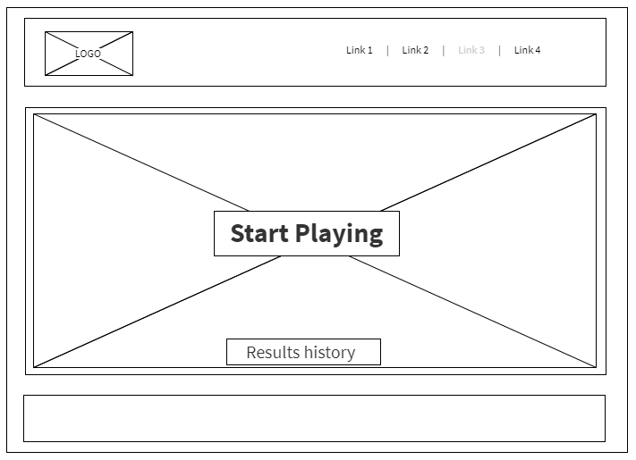
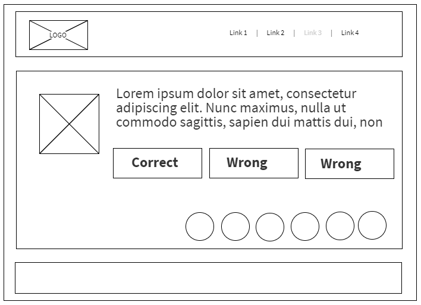
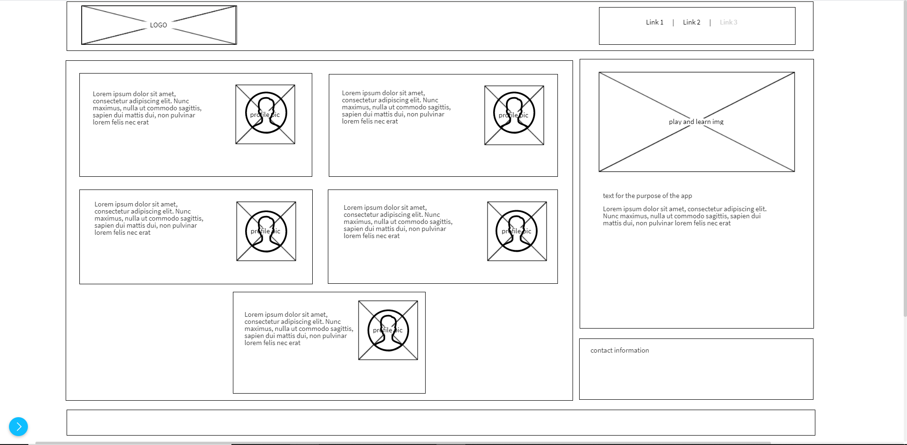
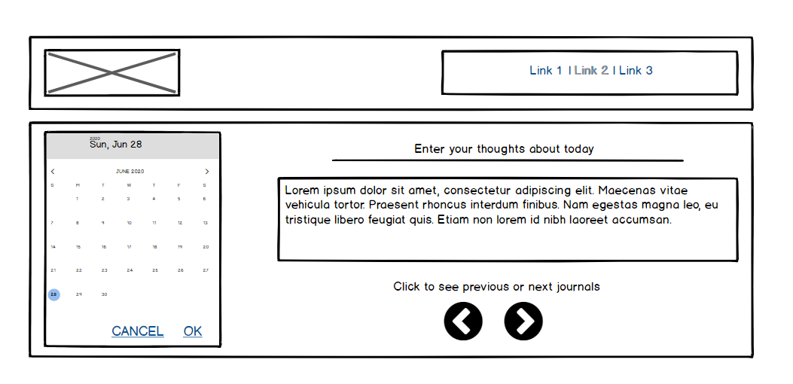
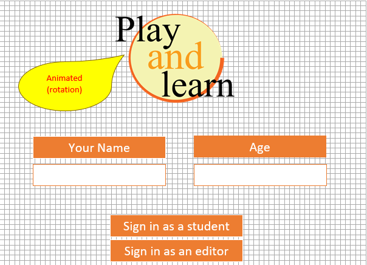
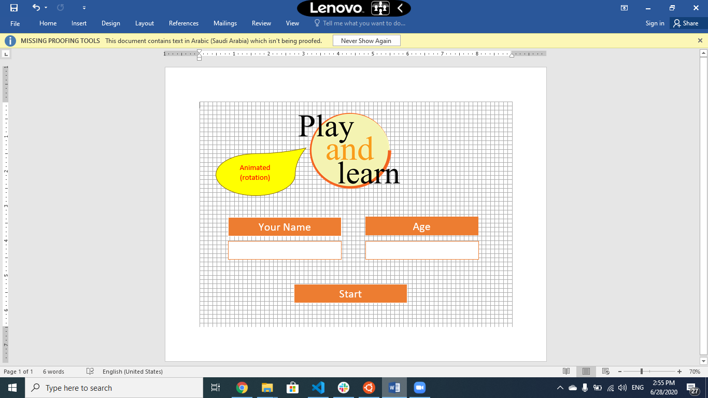

# Play&Learn
An edtech proof of concept to capture student attention and study their curriculum along the journey.

[Read more in the requirements](requirements.md)

### Home page

### Play game page

### About us page

### Journal page

### Login page

## Model Diagram

### Logo page

