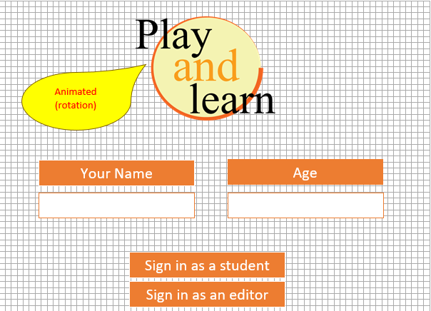
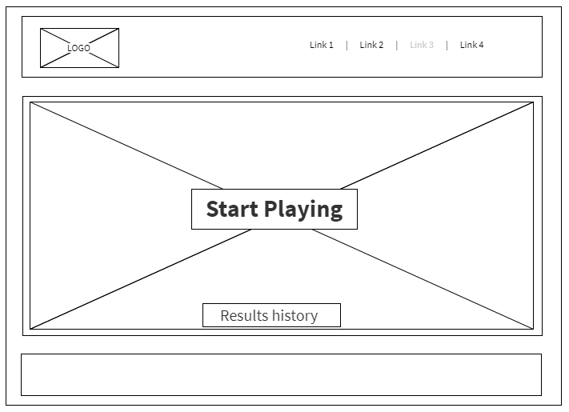
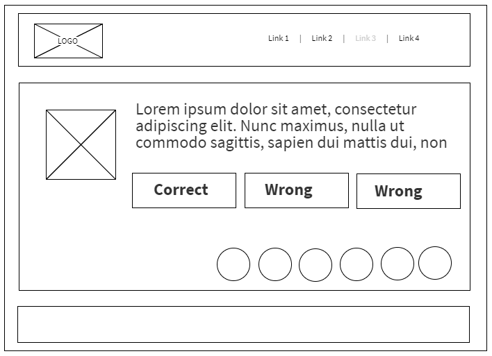
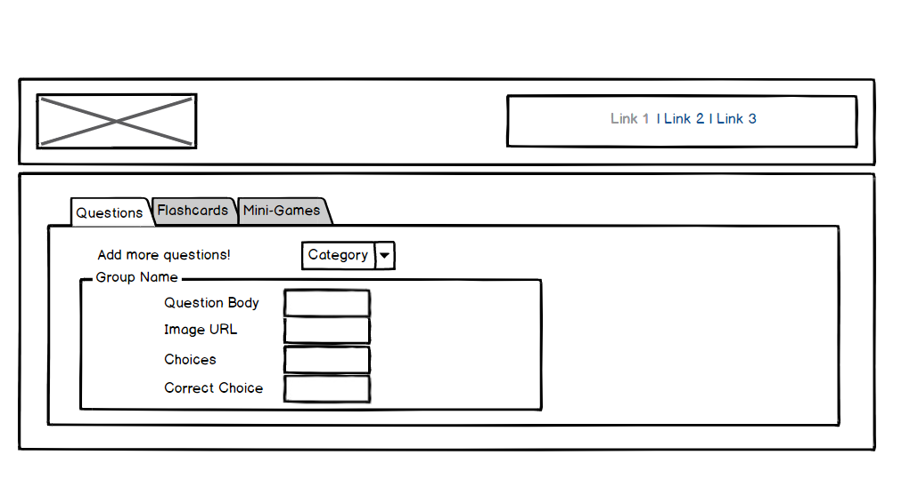
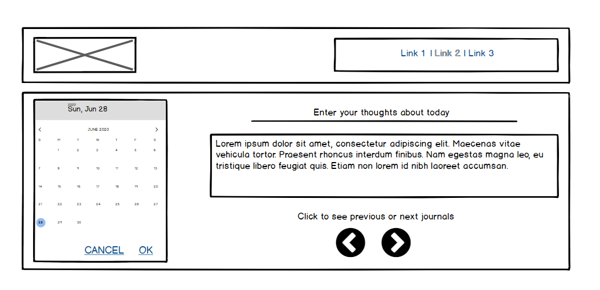
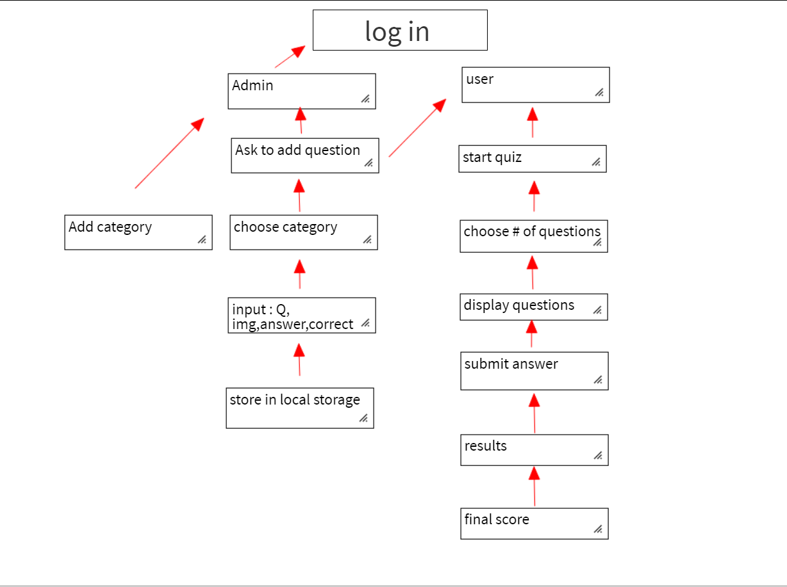

# Play&Learn
An edtech proof of concept to capture student attention and study their curriculum along the journey.

[Read more in the requirements](requirements.md)

### Login page

### Home page

### Play game page

### Add to the game page

### Journal page

### About us page

## Model Diagram

